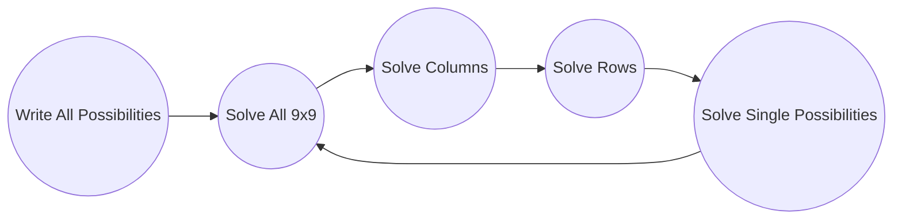

# What Is This Project ?

Hi! So let me tell you the story . it was late night and i was playing sudoku and i came up with a solution to solve the puzzle and i got the idea to turn it into an app , so i did what every programmer do in this situation and got up and started coding !

This algorithm **might be weird** and  **not efficient** but i'm happy that it is **my own solution** !

Code is messy (i was too tired) but maybe in the future i'll optimize it .

## How Does It Works ?

* **Write All Possibilities :** It will check every number in every cell if they can be placed on that cell it pushes the number to cell’s possibility array 
* **Solve All 9x9 :** It will check every 9x9 grid's cells possibilities and look for numbers that are not repeated in other grid cells possibilities and if any number found it will solve that cell with that number 
so basically if a possible number only exist in one cell of a 9x9 that number belongs to that cell
* **Solve Columns :** Basically this is same as **Solve 9x9** but instead of looking for non-repeated possible numbers in 9x9 it check every column and look for non-repeated numbers in every column
* **Solve Rows :** Same as **Solve Columns** but for rows !
* **Solve Single Possibilities :** This one checks every cell and see if there is a possibility array with only one possible number and if found any it will solve that cell with that number .
basically if a cell has only one possible number , for sure that number belongs to that cell.

**Note :**
 - After solving a cell it will remove that number from cell's row , column and 9x9 possibility arrays 
 - Process will continue until there is no possibility array left in cells , in other word until all cells are solved and filled with a number . 
